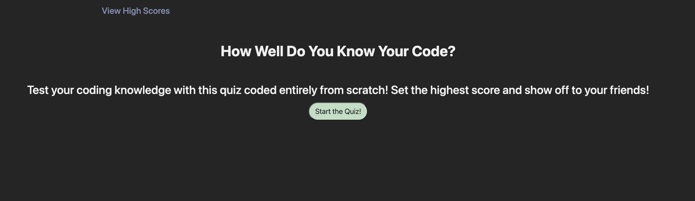
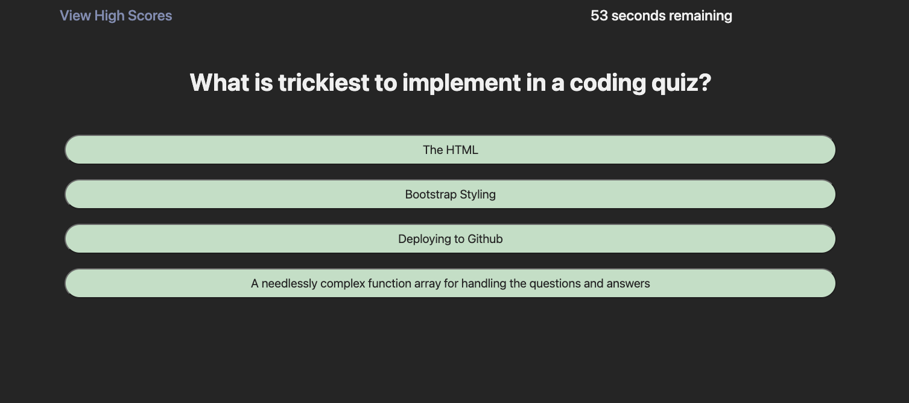

# Coding-Quiz

## What Is It?

A simple, timed quiz on various coding fundamentals.

## Where Is It?

You can take the quiz at [corynko.github.io/Coding-Quiz/](corynko.github.io/Coding-Quiz/).

## How Do I Use It?

Simply click on "Start the Quiz" to start the quiz. For each question, take your best guess, but be careful! For each question you miss, you'll lose 10 seconds. After you're done, submit your high score and challenge your friends!

## Who Can Use It?

Anyone can feel free to take the quiz, or modify the code to make their own.

## What's Wrong With It?

High scores are currently a little bit broken. Fixed in the next update.
